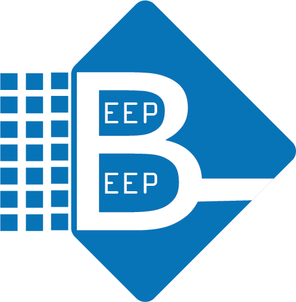
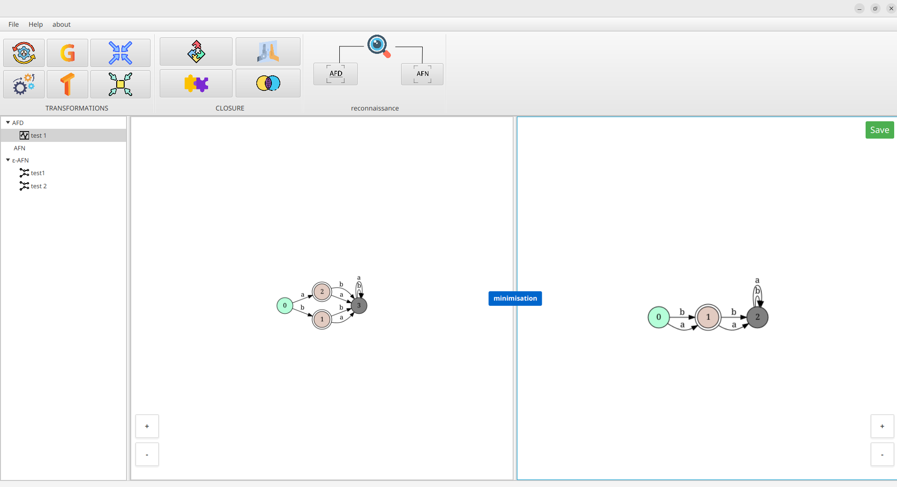

# Automaton Project

<p align="center">
  
</p>

<p align="center">
  A graphical application for visualizing and manipulating finite automata, featuring a C backend and a JavaFX frontend.
</p>

---

## Table of Contents

- [Features](#features)
- [Screenshots](#screenshots)
- [Technologies](#technologies)
- [Project Structure](#project-structure)
- [How to Run](#how-to-run)

---

## Features

*   **Automaton Creation:** Create and edit both deterministic (AFD) and non-deterministic (AFN) finite automata.
*   **Regular Expression Conversion:** Convert regular expressions to finite automata using Thomson's and Glushkov's algorithms.
*   **AFN to AFD Conversion:** Transform non-deterministic finite automata into deterministic ones.
*   **Automaton Minimization:** Minimize DFAs with Hopcroft's and Brzozowski's algorithms.
*   **Word Recognition:** Test if a word is accepted by an automaton.
*   **Automaton Operations:** Perform operations like complement, mirror, union, and intersection on automata.

---

## Screenshots

Here are some screenshots of the application in action:

| AFN to AFD Conversion | Automaton Editing |
| :-------------------: | :---------------: |
|  |  |

| Automaton Minimization | Regex to AFN (Thomson) |
| :--------------------: | :--------------------: |
|  |  |

---

## Technologies

*   **Backend:** C
*   **Frontend:** JavaFX, Maven

---

## Project Structure

The project is organized into two main directories:

*   `back_end/`: Contains all the core logic for automaton manipulation, written in C.
*   `front_end/`: The JavaFX-based graphical user interface.

---

## How to Run

### Backend

To build the backend, navigate to the `back_end` directory and execute the build script:

```bash
cd back_end
./build.sh
```

This will compile the C code and create a `main` executable in the same directory.

### Frontend

Ensure you have Java and Maven installed. To run the frontend application, navigate to the `front_end` directory and use the following commands:

```bash
cd front_end
mvn clean install
java -jar target/front_end-1.0-SNAPSHOT.jar
```

